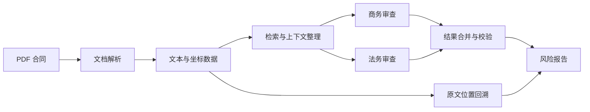

# SmartPact（智契）

合同合规审查原型，前端使用 Vue 3，后端使用 FastAPI。系统支持 PDF 解析、条款检索、多阶段风险审查和原文位置回溯。

- 在线演示：<https://ai.ybl666.xyz>
- 2026 中山大学 AI+商业创新大赛一等奖项目

## 功能

- 上传并解析 PDF 合同
- 提取页面、文本块和坐标信息
- 按商务、法务等审查维度生成风险项
- 对审查结果进行结构化校验
- 在前端定位风险条款对应的原文区域
- 保存任务、文件和审查结果

审查结果仅用于辅助复核，不能替代律师意见或正式合规流程。

## 技术结构



主要组件：

| 组件 | 用途 |
|---|---|
| Vue 3 | 前端界面 |
| FastAPI | API 与任务编排 |
| PostgreSQL | 业务数据 |
| Redis | 缓存与任务状态 |
| MinIO | 文件存储 |
| Milvus | 向量检索 |
| Docling | PDF 版面解析 |

## 本地运行

### 1. 准备环境变量

```bash
cp .env.example .env
```

必须修改以下密码：

```text
POSTGRES_PASSWORD
REDIS_PASSWORD
MINIO_ROOT_USER
MINIO_ROOT_PASSWORD
MILVUS_MINIO_USER
MILVUS_MINIO_PASSWORD
```

后端模型配置放在 `backend/.env`。不要把真实密钥提交到仓库。

### 2. 启动服务

```bash
docker compose up --build
```

默认地址：

```text
Frontend  http://localhost:5173
Backend   http://localhost:8002
```

数据库、Redis、MinIO 和 Milvus 默认只在 Compose 内部网络中可见；前后端端口绑定到本机回环地址。

### 3. 停止服务

```bash
docker compose down
```

删除本地数据卷：

```bash
docker compose down -v
```

## 目录

```text
.
├── backend/                 # FastAPI 后端
├── frontend/bank-ai/        # Vue 前端
├── docker-compose.yml
├── .env.example
└── README.md
```

## 开发说明

- 修改审查逻辑时，先确认输出 Schema 和前端字段仍然一致。
- PDF 坐标依赖解析结果，替换解析器后需要重新验证高亮定位。
- 不要在日志中记录合同正文、模型密钥或完整上游响应。
- 面向公网部署时，应增加身份认证、权限控制、审计日志和数据留存策略。

## License

见 [LICENSE](LICENSE)。
